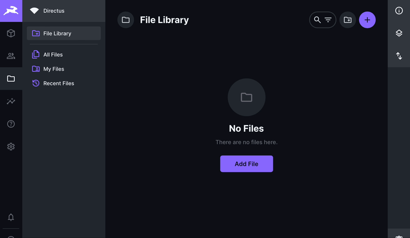

# Media AI Bundle

This is a collection of media-related AI extensions for [Directus](https://directus.io), to help you enhance the file library in your next project.



---

## 📋 Details

### ⚡️ Operations

---

#### Describe image

Describe the contents of an image in text form. Useful for creating alt-texts or captions. The format of the returned description varies between different API:s, read below for details.

Required API: [AltText.ai](https://alttext.ai) or [Amazon Rekognition](https://aws.amazon.com/rekognition/)

<details><summary><code>Successful result</code></summary>

With AltText.ai as API, the `description` will be a more descriptive text:

```json
{
  "description": "A cat wearing glasses with red lights on it.", // Image description
  "$raw": {...} // The original response from the API
}
```

With Amazon Rekognition as API, the `description` will be a comma-separated list of labels:

```json
{
  "description": "Light, Animal, Fish, Sea Life, Shark, Cat, Kitten, Mammal, Pet", // Image description
  "$raw": {...} // The original response from the API
}
```

</details>

---

#### Extract text from image

Detect text (printed or handwritten) from images and extract them to a single string.

Required API: [Amazon Rekognition](https://aws.amazon.com/rekognition/)

<details><summary><code>Successful result</code></summary>

> [!NOTE]  
> This operation will be triggered as successful even if no text is found. In that case, `full_text` will be an empty string.

```json
{
  "lines": [
    {
      "text": "Lorem ipsum", // Line of text found in an image
      "confidence": 99.63353729248047, // How certain the AI is that this match is correct (up to 0.0-100.0)
      "geometry": { // Coordinates where the text was found (0.0-1.0)
        "top": 0.0693359375,
        "left": 0.0615234375,
        "height": 0.0869140625,
        "width": 0.513671875
      }
    }
  ],
  "full_text": "Lorem ipsum" // All lines concatenated into a single string,
  "$raw": {...} // The original response from the API
}
```

</details>

---

## 🛠️ Setup

### Step 1 - Installation

Run: `pnpm install directus-extension-media-ai-bundle`

Or download the release and put it in your `extensions/` folder.

### Step 2 - API keys

Next you need to provide API keys for the services you want to use:

#### AltText.ai

| Variable                | Description             |
|-------------------------|-------------------------|
| `ALTTEXT_AI_API_KEY`    | Your AltText.ai API key |

#### Amazon Rekognition

This extension uses AWS SDK for JavaScript V3 and you might be able to use some of the alternatives listed in [their developer guide](https://docs.aws.amazon.com/sdk-for-javascript/v3/developer-guide/setting-credentials-node.html), but if you run Directus in a Docker environment it might be easiest to configure credentials with environment variables. Refer to [this page](https://docs.aws.amazon.com/IAM/latest/UserGuide/id_credentials_access-keys.html) for information on how to get your access keys.

| Variable                | Description             |
|-------------------------|-------------------------|
| `AWS_ACCESS_KEY_ID`     | Your AWS access key     |
| `AWS_SECRET_ACCESS_KEY` | Your secret key         |
| `AWS_REGION`            | Which [region](https://docs.aws.amazon.com/general/latest/gr/rekognition.html) you want to connect to |

---

## 🔮 Roadmap

- Use Transformations to resize and convert images before sending them to the API.
- Video support where it makes sense.
- Support for other API:s, like Azure Vision AI.
- More operations or other Directus extensions - feel free to send ideas or contribute with your own pull requests.
- More configuration options, such as language, minimum confidence etc.

---

## ❤️ Collaborators

- Arood
- You?